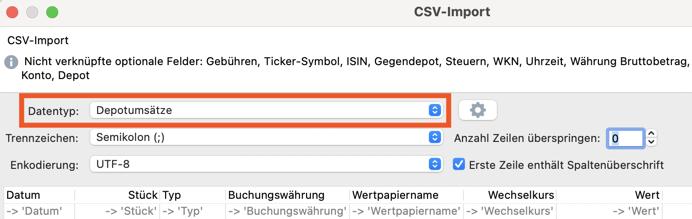

# ppcryptoparser

<!-- badges: start -->
[](https://CRAN.R-project.org/package=ppcryptoparser)
[](https://lifecycle.r-lib.org/articles/stages.html#experimental)
[](https://github.com/pat-s/ppcryptoparser/actions)
<!-- badges: end -->

The goal of {ppcryptoparser} is to simplify the import of staking reward from various altcoins into [Portfolio Performance](https://www.portfolio-performance.info/).

## Installation

You need a working installation of [R](https://www.r-project.org/).

Windows: `scoop install r` or [download from CRAN](https://cran.r-project.org/).

macOS: `brew install --cask r` or [download from CRAN](https://cran.r-project.org/).

Ubuntu: `apt install r-base`

You can then install `ppcryptoparser` from GitHub with:

``` r
install.packages("remotes")
remotes::install_github("pat-s/ppcryptoparser")
```

## Example

Spin up an R session by calling "R" in a terminal and then run

```r
library("ppcryptoparser")

parse_polkadot(<address>, <csv output file>)
```

Please also consult the help files for each function, either on the command line via `?<function name>` or by looking at the [pkgdown](https://pat-s.github.io/ppcryptoparser) page of this package.

## Supported Coins

- Cardano (ADA)
- Polkadot (DOT)
- Kusama (KSM)

## Planned Support

- Terra (LUNA)
- Solana (SOL)
- Polygon (MATIC)

## Language & Currency

The default language is set to (US) English (`"EN"`).
The language setting should match the language used in Portfolio Performance.

## Encoding & Windows

I've seen that on Windows machines, the encoding might be set to something else than "UTF-8", causing issues in the processing.

Also Windows seems to set the decimal separator to `.` instead of `,`, which causes a wrong import of the data.
In this case, edit the resulting `.csv` file and change the decimal separators from `,` to `.` and check whether the import is working as intended.
I might add an argument to the functions to account for this within the R package.

## CSV Import

When importing, ensure to choose the type "Depotumsätze" / "Portfolio Transactions":


